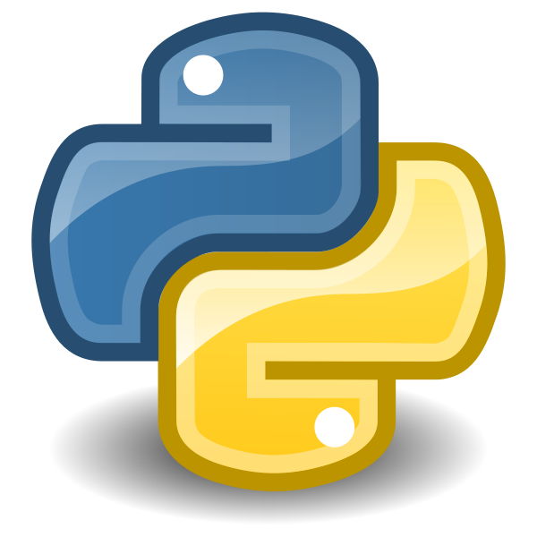

### Hi there 👋. Welcome to my Github Portfolio

### ✨ About Me

I am a Recent Graduate in Master of Science in Data Analytics Engineering from Northeastern University, Boston.
I have 3 years of work experience in the field of Data Analytics/Science. 

🔗  **Connect with me**

<!--
**UtkarshS007/UtkarshS007** is a ✨ _special_ ✨ repository because its `README.md` (this file) appears on your GitHub profile.

Here are some ideas to get you started:

- 🔭 I’m currently working on ...
- 🌱 I’m currently learning ...
- 👯 I’m looking to collaborate on ...
- 🤔 I’m looking for help with ...
- 💬 Ask me about ...
- 📫 How to reach me: ...
- 😄 Pronouns: ...
- ⚡ Fun fact: ...
-->

  
<b>🛠️&nbsp;&nbsp;Languages&nbsp;and&nbsp;Tools</b>

   
  

    
    
    
    
    
    
    
    
    
    
    
  

  
    
    
    
